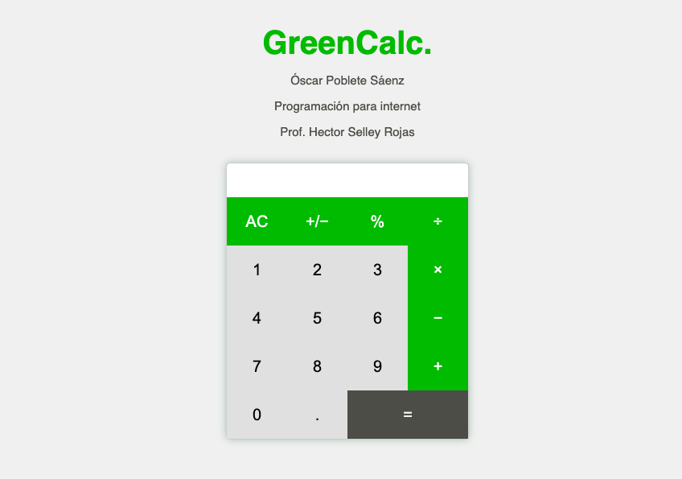

## Estructura
#### HTML (calculadora.html):
- Enlaza una hoja de estilos externa (estilo.css) para aplicar estilos al contenido.
- Representa la calculadora por medio de un contenedor con la clase "calculadora".
- Incluye una pantalla de entrada de texto habilitada solo para lectura y un conjunto de botones para interactuar con la calculadora.
- Cada botón tiene su propio identificador (id) y, en algunos casos, clases que determinan su estilo y función.
- Se carga un script JavaScript (operaciones.js) al final del cuerpo para proporcionar la funcionalidad de la calculadora.

## Estilo:
#### CSS (estilo.css):
- Establece estilos para el cuerpo de la página, botones, pantalla y diseño general de la calculadora.
- Define colores, tamaño de fuente, espaciado y otras propiedades de estilo para garantizar una apariencia agradable y funcional de la calculadora en la interfaz de usuario.

## Comportamiento:
#### JS (operaciones.js):
- Gestiona el estado de la pantalla de la calculadora.
- Actualiza y modifica el estado de las variables.
- Procesa clics en los botones, efectuando las operaciones correspondientes.

## Previsualización:

